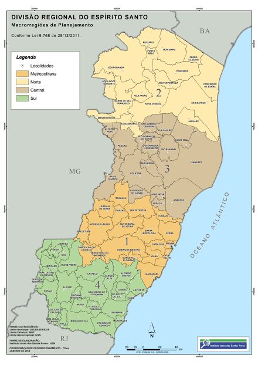

```{r setup, include=FALSE}
knitr::opts_chunk$set(echo = TRUE,
                      message = FALSE,
                      warning = FALSE)
```

# Introdução
 
Diante da recente pandemia do novo coronavirus, ressalta-se a importância da discussão de políticas públicas para diferentes os grupos raciais da população brasileira. Aqui no Espírito Santo, foi criado o Observatório Capixaba da COVID-19 nas Favelas [(OCOFA)](http://ocofa.org/), com pesquisadores de diversas áreas: epidemiologia, estatística, ciências sociais, serviço social, geografia, design e comunicação. Em especial, o objetivo deste observatório é produzir dados sobre os impactos sociais da pandemia nas favelas e na população negra.

Com essa temática em mente, nesse post vamos discutir como utilizar dados do [Painel da Covid-19 do ES](https://coronavirus.es.gov.br/painel-covid-19-es) para mostrar como podemos utilizar essas informações para produzir algumas análises importantes nesse momento. 
Primeiramente vamos carregar alguns pacotes que iremos utilizar:
 
```{r message=FALSE}
library(readr)
library(forcats)        # trabalhar com fatores
library(ggthemes)       # temas para gráficos
library(dplyr)          # transformar dados
library(ggplot2)        # fazer gráficos lindos
library(stringr)        # para trabalhar com textos
```

Após carregar os pacotes, iremos carregar o conjunto de dados. Uma forma de ler diretamente essa informação no R pode ser feita da seguinte forma.  

```{r eval=F}
dados <- read.csv("https://bi.static.es.gov.br/covid19/MICRODADOS.csv",
                  sep = ";",
                  fileEncoding = "ISO-8859-1")
```

```{r echo=FALSE}
dados <- read.csv("MICRODADOS.csv",
                  sep = ";")

```


Outra maneira de obter a planilha, é baixando-a diretamente pelo site e importando do seu computador, substituindo o caminho `https://bi.static.es.gov.br/covid19/MICRODADOS.csv` pelo local onde o arquivo está salvo no seu computador. Agora podemos começar a organizar os dados para fazermos as análises. 

Observação: A base de dados útlizada para fazer as análises foi baixada no dia 16/11/2020 

# Preparando a base de dados

Como queremos fazer a análise baseada nos casos confirmados, podemos começar aplicando um filtro para selecionarmos apenas esses casos. Depois disso, usaremos o pacote `forcats` para mudarmos os níveis da variável "Sexo". Em seguida, vamos criar uma nova variável chamada "Idade" que vai receber apenas os dois primeiros dígitos da varíavel "IdadeNaNotificacao".

```{r, eval=TRUE}
dados <- filter(dados, Classificacao == "Confirmados")
dados <- dados %>% 
  mutate(Sexo = fct_recode(Sexo, 
                    Masculino ="M",
                    Feminino = "F",
                    Ignorados = "I"))

dados <- dados %>% 
  mutate(Idade = str_sub(IdadeNaDataNotificacao, end = 2))
```

```{r, echo=FALSE}
dados <- read.csv("MICRODADOS.csv", sep = ";")
dados <- filter(dados, Classificacao=="Confirmados")
dados$Sexo <- fct_recode(dados$Sexo, 
                    Masculino ="M",
                    Feminino = "F",
                    Ignorados = "I")
dados$Idade <- str_sub(dados$IdadeNaDataNotificacao, end = 2)
```


Com essas filtragens, já podemos começar a gerar alguns gráficos interessantes como, por exemplo, a quantidade de casos confirmados separados por faixa etária, a quantidade de casos confirmados separados por Raça/Cor e um histograma de frequência separado por sexo. Vale ressaltar, que para gerar o histograma é necessário mudarmos a varíavel "Idade" para o tipo `numeric` do `R`, utilizando a função `as.numeric`.  

# Analisando a variável idade


```{r fig.width = 9, fig.height = 7}

ggplot(dados) +
  geom_bar(aes(x = FaixaEtaria), fill = "purple") +
  labs(y = "Frequência",
       x = "Faixa Etária",
       title = "Gráfico de frequência ") +
  scale_y_continuous(breaks = seq(0, 100000, 2500)) +
  theme_calc()

```

Neste gráfico podemos observar a frequência de casos confirmados de acordo com faixas etárias. Observamos que as faixas etárias de 30 a 39 anos, 20 a 29 anos e 40 a 49 anos foram as 3 faixas etárias com mais casos, respectivamente. Podemos notar também, que conforme a faixa etária vai aumentando, a frequência de casos confirmados vai dimuindo. Nota-se também que as faixas etárias entre 0 a 19 possui uma presença pequenas, mas acontece um grande salto quando entramos no grupo de pessoas entre 20 e 29 anos. 


Para o próximo gráfico, aplicamos um filtro na variável sexo que removeu os dados classificados como "Ignorados", para melhorar a visualização e a comparação entre os sexos "Masculino" e "Feminino", já que existia uma quantidade pequena de ignorados.

```{r fig.width = 9, fig.height = 7}
# Retirando as observações com Sexo == "Ignorados"
dados <- filter(dados, Sexo != "Ignorados")
```

```{r fig.width = 9, fig.height = 7}
dados <- dados %>% 
  mutate(Idade = as.numeric(Idade))

ggplot(dados, aes(x = Idade, y = ..density..)) +
  geom_histogram(color = "white", bins = 50, fill = 'purple') +
  facet_wrap(~ Sexo) +
  theme_bw() +
  ylab("Densidade") +
  scale_fill_viridis_d()
```

Neste histograma de densidade podemos comparar os sexos masculino e o feminino. Podemos notar que não existe muita diferença nos dois sexos para este gráfico, na verdade, eles são bem semelhantes.


# Analisando por raça/cor

```{r}
ggplot(dados) +
  geom_bar(aes(x = RacaCor, fill = RacaCor)) +
  scale_y_continuous(breaks = seq(0, 200000, 10000)) +
  labs(y = "Frequência",
       x = "Raça/Cor",
       title = "Gráfico de frequência") +
  theme_bw() +
  scale_fill_viridis_d(name = "Raça/Cor")
```

ao olharmos para esse gráfico, observamos que pessoas brancas e pardas tem uma presença muito grande e possuem uma frequência bem proxima uma da outra. Nota-se também que existe uma grande quantidade de pessoas que tiveram sua raça considerara "ignorada". A raça indígena é a que possui a menor frequência dentre as presentes.


# Análise por região

Uma análise interessante a ser feita é considerarmos os casos nas diferentes regiões do Espírito Santo. Seguimos a divisão feita pelo Governo do Estado que pode ser encontrada [clicando aqui](http://www.ijsn.es.gov.br/mapas/), onde o Estado foi dividido nas seguintes regiões: Metropolitana, Central, Norte e Sul. Esta divisão pode ser vista na figura a seguir.




Usamos uma função para atribuirmos cada cidade a sua devida região.


```{r message=FALSE}
classifica_regiao <- function(Municipio){
  reg_metropolitana <- c(
  'VITORIA',
  "DOMINGOS MARTINS" ,
  "SANTA LEOPOLDINA" ,
  "MARECHAL FLORIANO" ,
  'FUNDAO' ,
  'SERRA' ,
  'VILA VELHA' ,
  'CARIACICA' ,
  'VIANA' ,
  'GUARAPARI' ,
  "SANTA LEOPOLDINA" ,
  "DOMIGOS MARTINS" ,
  "MARCHAL FLORIANO" ,
  "SANTA TERESA" ,
  "SANTA MARIA DO JETIBA" ,
  "ITAGUACU" ,
  "LARANJA DA TERRA" ,
  "ITARANA" ,
  "AFONSO CLAUDIO" ,
  "VENDA NOVA DO IMIGRANDE" ,
  "BREJETUBA" ,
  "CONCEICAO DO CASTELO"
 )
  reg_norte <- c(
    "AGUIA BRANCA " ,
    "VENDA NOVA DO IMIGRANTE" ,
    "SANTA MARIA DE JETIBA" ,
    "MANTENOPOLIS" ,
    "JAGUARE" ,
    "SAO MATEUS" ,
    "NOVA VENECIA" ,
    "BARRA DE SAO FRANCISCO" ,
    "VILA PAVAO" ,
    "BOA ESPERANCA" ,
    "AGUA DOCE DO NORTE" ,
    "CONCEICAO DA BARRA" ,
    "PINHEIROS" ,
    "PEDRO CANARIO" ,
    "MONTANHA" ,
    "MUCURICI" ,
    "PONTO BELO" ,
    "ECOPORANGA"
  )
  
  reg_central <- c(
    "ARACRUZ" ,
    "IBIRACU" ,
    "JOAO NEIVA" ,
    "SAO ROQUE DO CANAA" ,
    "BAIXO GUANDU" ,
    "COLATINA" ,
    "MARILANDIA" ,
    "LINHARES" ,
    "RIO BANANAL" ,
    "PANCAS" ,
    "SOORETAMA" ,
    "GOVERNADOR LINDENBERG" ,
    "SAO DOMINGOS DO NORTE" ,
    "ALTO RIO NOVO" ,
    "SAO GABRIEL DA PALHA" ,
    "VILA VALERIO"
  )
  
  reg_sul <- c(
    'PRESIDENTE KENNEDY'	,
    "MUQUI" ,
    'MARATAIZES'	,
    'ITAPEMIRIM'	,
    'MIMOSO DO SUL' ,
    'APIACA' ,
    'BOM JESUS DO NORTE' ,
    'SAO JOSE DO CALCADO' ,
    "MUQI" ,
    "ATILIO VIVACQUA" ,
    "PIUMA " ,
    "RIO NOVO DO SUL" ,
    "CACHOEIRO DE ITAPEMIRIM" ,
    "JERONIMO MONTEIRO" ,
    "ALEGRE" ,
    "GUACUI" ,
    "DORES DO RIO PRETO" ,
    "DIVINO DE SAO LOURENCO" ,
    "IBITIRAMA" ,
    "IUNA" ,
    "IBATIBA" ,
    "IRUPI" ,
    "MUNIZ FREIRE" ,
    "CASTELO" ,
    "VARGEM ALTA" ,
    "ALFREDO CHAVES" ,
    "ANCHIETA" ,
    "ICONHA" ,
    "RIO NOVO DO SUL" ,
    "PIUMA" ,
    "ICONHA"
  )
  regiao <- 
    ifelse(any(Municipio == reg_metropolitana),
           "Região Metropolitana", 
           ifelse(any(Municipio == reg_norte), 
                  "Região Norte", 
                  ifelse(any(Municipio == reg_central), 
                         "Região Central", 
                         ifelse(any(Municipio == reg_sul), 
                                "Região Sul", "Outro Estado")
                         )
                  )
           )
  return(regiao)
}
dados$regiao <- sapply(dados$Municipio, classifica_regiao)
```

Agora conseguimos observar a quantidade de casos por região:

```{r fig.width = 9, fig.height = 7}
ggplot(dados) + geom_bar(aes(x = regiao, fill = regiao)) +
  #scale_y_continuous(breaks = seq(0, 1000000, 10000)) +
  labs(y = "Frequência",
       x = "Regiões do Espirito Santo",
       title = "Gráfico de frequência") +
  theme_bw() +
  scale_fill_viridis_d() +
  facet_grid(scales = "free")
```

Podemos notar o quanto a região metropolitana se destaca em relação às outras, pois possui mais casos confirmados do que as outras 4 regiões juntas. Porém, deve-se ressaltar que tal região essa região é a mais populosa do Estado. A região norte, considerando as observações somente do Espírito Santo, foi a que menos registrou casos. 

Agora, iremos analisar em cada uma dessas regiões, os casos confirmados separados por sexo e raça/cor. Uma observação a ser feita é que como o número de observações com sexo igual a "Ignorado" é pequeno, foi feito um filtro para retirar esses casos do gráfico. Também retiramos as observações de outros Estados. Utilizamos a função `facet_wrap` para separar os gráficos por região.

```{r}
dados %>% 
  filter(regiao != "Outro Estado", 
         Sexo != "Ignorado") %>% 
  ggplot() +
  geom_bar(aes(RacaCor, fill = Sexo), position = "dodge") +
  labs(y = "Frequência", x = "Raça/Cor") +
  facet_wrap(~ regiao, ncol = 2, scales = "free") +
  theme_bw() + 
  scale_fill_viridis_d() +
  theme(axis.text.x = element_text(angle = 45, vjust = 0.5))
```
    
De forma geral, ao olharmos para a variável sexo, o número de casos para o sexo feminino é maior em relação ao sexo masculino em quase todas as situações. Se olharmos agora para a variável raça/cor, é visível que as classificações branca e parda têm uma frequência muito maior em relação às outras, enquanto que a raça indígena, apesar de presente nas 4 regiões, tem uma frequência maior na região central.

Podemos observar também a distribuição dos casos separados por sexo, ao longo do tempo. 

```{r message = F}
dados <- dados %>%
  mutate(DataNotificacao = as.Date(DataDiagnostico)) %>% 
  filter(DataNotificacao > as.Date("2020-01-01")) # retirando erro da base

casos_t <- dados %>%
  group_by(Sexo, DataNotificacao) %>%
  summarise(n_casos = n()) %>%
  tidyr::complete(
    tidyr::nesting(Sexo),
    DataNotificacao = seq.Date(min(dados$DataNotificacao),
                               max(dados$DataNotificacao),
                               by = "day"),
    fill = list(n_casos = 0)
  ) %>%
  mutate(casos_acumulados = cumsum(n_casos))

ggplot(casos_t) +
  theme_minimal() +
  aes(x = DataNotificacao, y = casos_acumulados, color = Sexo) +
  geom_line() +
  scale_color_viridis_d() +
  labs(y = "Número de casos acumulados",
       x = "Data Diagnóstico",
       title = "Casos acumulados por sexo")
```

Observando o gráfico de casos acumulados separado por sexo, podemos ver de forma mais clara o que foi dito anteriormente. O sexo femino tem uma frequência consideravelmente maior em relação ao sexo masculino, o que pode ser obervador por todo o intervalo de tempo analisado.

Uma última análise interessante a ser feita, é calcular a taxa de letalidade da COVID-19. Para fazer isso precisamos calcular esse índice, podendo separar essa informação considerando algumas variáveis de interesse.

Para fazer essa tarefa criamos um `data.frame` chamado `casos` agrupando as variáveis "RacaCor" e "Sexo", fazendo a contagem de casos confirmados. Depois, criamos um outro `data.frame` com as mesmas variáveis, porém esse vai contar o número de mortes pela COVID-19. Por último, utilizamos a função `inner.join`  para gerar o `data.frame` chamado "letalidade", onde calculamos a taxa de letalidade da COVID-19. Vale ressaltar que a taxa de letalidade é a proporção entre o número de óbitos por uma doença em relação ao número de indivíduos acometidos por essa doença.

```{r message=F}
casos <- dados %>%
  group_by(RacaCor, Sexo) %>%
  summarise(n_casos = n())

mortes <- dados %>%
  filter(Evolucao ==  "Óbito pelo COVID-19") %>%
  group_by(RacaCor, Sexo) %>%
  summarise(n_mortes = n())

letalidade <- inner_join(casos, mortes) %>%
  mutate(taxa_l =   ifelse(n_casos == 0, 0,
                           round(100 * n_mortes / n_casos, 1)))
```

Por último podemos fazer o gráfico dessa informação:

```{r message=F}
ggplot(letalidade) + 
  geom_col(aes(x = RacaCor, y = taxa_l, fill = Sexo), position = "dodge") +
  labs(x = "Pessoas",
       y = "Letalidade (%)",
       title = "Taxa de letalidade da COVID-19 no ES") +
  scale_fill_viridis_d() +
  theme_bw()
```

Ao observamos o gráfico, notamos que a taxa de letalidade do sexo masculino é sempre maior em relação ao sexo feminino em todas as raças. É possível notar também que para raça "Indígena" só observamos valores para o sexo "Masculino". As maiores taxas para ambos os sexos foi observada na raça "Amarela".

Existem diversas outras variáveis no banco de dados além daquelas que utilizamos aqui. A ideia desse post foi apenas ilustrar como utilizar algumas informações e como fazer alguns gráficos descritivos. Outras ideias de análise desse banco de dados também podem ser vistas no site do [OCOFA](http://ocofa.org/). 
